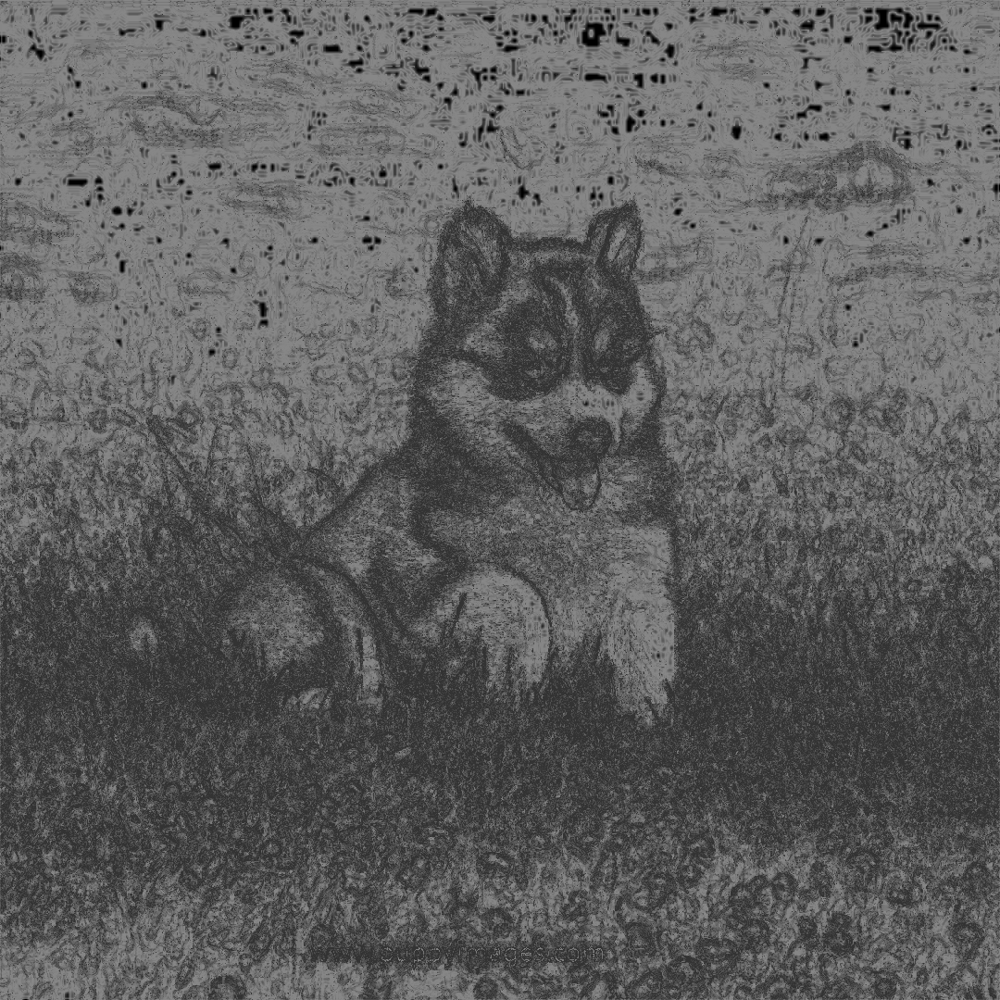

## Summary
Project to calculate the entropy of an image, in the information theoritical sense. Entropy can be calculated by the equation H(X) = -p log(p), where p is the probability of event X. 
This in some sense measures the average information conveyed by an event or the extent to which information can be compressed. 
The main reason why I found computing the entropy of images to be interesting is because estimating the probability p does not have a clear best value. 
The method I found commonly used by some larger libraries like matlab used the histogram of image pixels, but this has very clear failures when the image has spatial structure (see Examples). 
I also trained an all against all SVM on a subset of [MNIST data](http://cis.jhu.edu/~sachin/digit/digit.html) and found error rates for the voting of SVMs decreased by 10% when using unweighted local entropy calculations. 
This came at the cost of much more computing time as the dimension of the vectors was doubled. With more difficult classification tasks, entropy data might have more effect, as voting accuracy was above 90% and the majority prediction was 100% accurate with or without entropy.
## Files
- Entropy.cpp: Computes the entropy of images by pixel. Requires OpenCV library to be linked. Can then be run with ./Entropy [input file] [one char flag]
- Entropy.h: header file for entropy
- SVM.cpp: files
## How to use
- Install [OpenCV library](https://docs.opencv.org/4.4.0/d9/df8/tutorial_root.html) and compile
- Then can be run from the command line with ./Entropy [input file] [entropy options] [output file]
- Entropy options are single letters potentially followed by an integer parameter # for radius:
	- H: histogram of all grayscale intensities to estimate probabilities. No parameter
	- N: Fits normal/gaussian distrubtion to the pixels
	- L#: Uses histogram of all pixels within # of central pixel.
	- D#: Uses histogram of all pixels within # of central pixel weighted by the inverse of distance.
	- G#: Uses histogram of all pixels within # of central pixel weighted by gaussian kernel. Note this only works well for values below 6 as the ratio of the center of the gaussian to edges eventually exceeds the capacity of a 32 bit integer and has no effect on the 256 bit range of pixels.
## Examples
- Original images used:

	

        <h4>Checkers</h4>
        
    

	

        <h4>Half-plane</h4>
        
    

    

        <h4>Noise</h4>
        
    

	

        <h4>Milky Way</h4>
        
    

	

        <h4>Cute puppy</h4>
        
    

-H: Entropy by calculating the histogram of all grayscale pixels. but will not account for any kind of spatial structure. The half-plane or checkers can clearly be compressed substantially more than the noise, but this measure gives the same entropy because they are both 50% white and 50% black. 
On real images with decent resolution, the probabilities tend to be very low because the pixels are distributed across 256 bins and therefore the entropy tends to be low per pixel.

	

        <h4>Checkers</h4>
        
    

	

        <h4>Half-plane</h4>
        
    

    

        <h4>Noise</h4>
        
    

	

        <h4>Milky Way</h4>
        
    

	

        <h4>Cute puppy</h4>
        
    

-L3: Local entropy on the other hand much more accuractely can account for spatial information. Something like the half plane is very compressable because of the structure while the noise is too disordered to compress much. These examples use a radius of 3

	

        <h4>Checkers</h4>
        
    

	

        <h4>Half-plane</h4>
        
    

    

        <h4>Noise</h4>
        
    

	

        <h4>Milky Way</h4>
        
    

	

        <h4>Cute puppy</h4>
        
    

-D3: Distance weighted entropy functions similarly to local entropy but generally has a higher entropies, likely because the nearest pixels tend to be more similar so the probabilities are closer to 0.5. These examples also use a radius of 3

	

        <h4>Checkers</h4>
        
    

	

        <h4>Half-plane</h4>
        
    

    

        <h4>Noise</h4>
        
    

	

        <h4>Milky Way</h4>
        
    

	

        <h4>Cute puppy</h4>
        
    

- As radius increases, the entropies tend to become smoother

	

        <h4>Milky Way L2</h4>
        
    

	

        <h4>Milky Way D2</h4>
        
    

	

        <h4>Cute puppy L2</h4>
        
    

	

        <h4>Cute puppy D2</h4>
        
    

	

        <h4>Milky Way L6</h4>
        
    

	

        <h4>Milky Way D6</h4>
        
    

	

        <h4>Cute puppy L6</h4>
        
    

	

        <h4>Cute puppy D6</h4>
        
    

	

        <h4>Milky Way L12</h4>
        
    

	

        <h4>Milky Way D12</h4>
        
    

	

        <h4>Cute puppy L12</h4>
        
    

	

        <h4>Cute puppy D12</h4>
        
    

